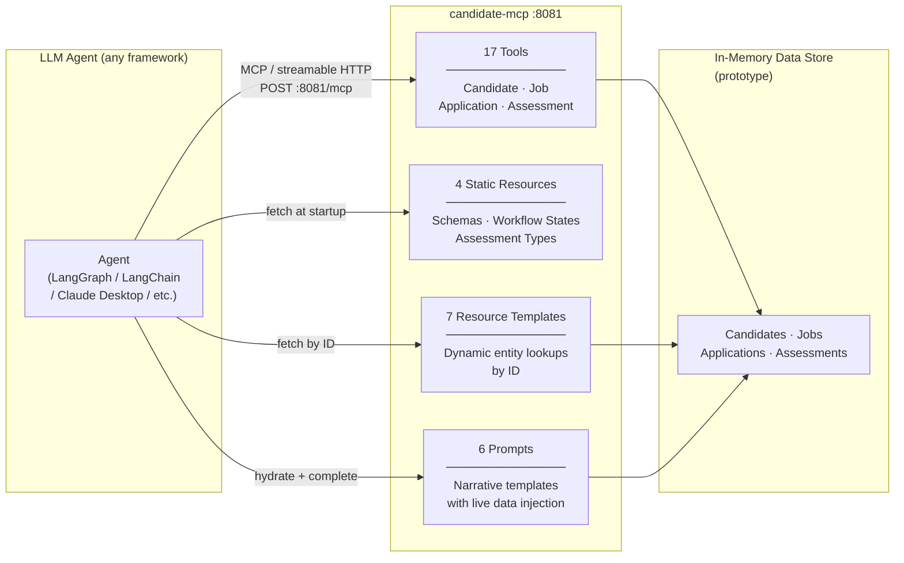
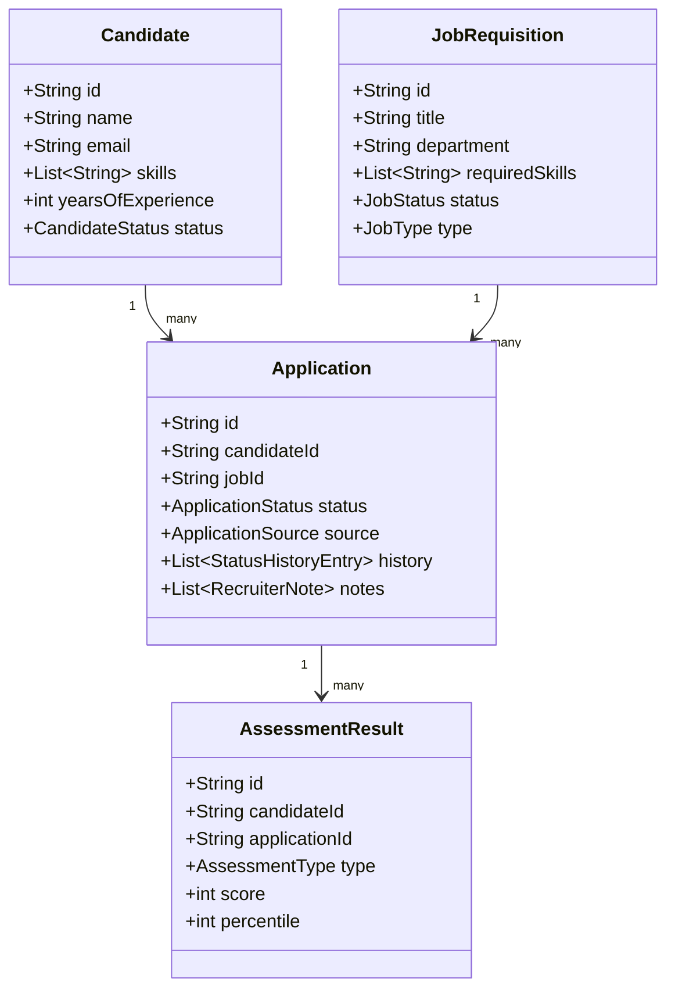

# candidate-mcp

A **stateless Model Context Protocol (MCP) server** for the ATS candidate domain, built with Spring Boot 3.5 and Spring AI 1.1. It exposes hiring-pipeline data — candidates, jobs, applications, and assessments — as structured tools, resources, and prompts that LLM agents can consume directly.

This server acts as the **data and domain layer** between any LLM agent framework and the ATS backend. Agents call tools to retrieve live data; schema resources are fetched once at agent startup to ground the LLM in the domain's data model without extra runtime calls.

---

## Architecture



---

## MCP Capabilities

### Tools (17)

| Category | Tool | Description |
|---|---|---|
| **Candidate** | `getCandidateProfile` | Full profile: skills, experience, education, status |
| | `getJobsMatchingCandidate` | Jobs that match a candidate's skill set |
| | `getSkillsGap` | Gap analysis between a candidate's skills and a target job |
| **Job** | `getJob` | Single job requisition by ID |
| | `listOpenJobs` | All open job requisitions |
| | `searchOpenJobs` | Search open jobs by keyword |
| **Application** | `getApplicationStatus` | Current stage, days in stage, SLA health |
| | `getApplicationsByCandidate` | All applications for a candidate |
| | `getCandidateJourney` | Full cross-application narrative |
| | `getNextSteps` | Stage-specific candidate guidance |
| | `getStageDuration` | Days spent in the current stage |
| | `getInterviewFeedback` | Interview rounds and recruiter notes |
| **Assessment** | `getAssessmentResults` | All assessment results for a candidate |
| | `getAssessmentByType` | Results filtered by assessment type |
| | `compareToPercentile` | Score comparison against the candidate pool |
| **Schema** | `getEntitySchema` | JSON Schema for any ATS domain entity |
| | `getWorkflowTransitions` | Valid stage transitions and SLA expectations |

### Static Resources (4)

Fetched once at agent startup and embedded into the LLM system prompt. This grounds the agent in the domain's data model without a runtime tool call on every request.

| URI | Content |
|---|---|
| `ats://schema/candidate` | JSON Schema for the Candidate entity |
| `ats://schema/application` | JSON Schema for the Application entity |
| `ats://workflow/application-states` | Full application state machine with SLA expectations |
| `ats://workflow/assessment-types` | Assessment type catalogue with scoring metadata |

### Resource Templates (7)

Dynamic lookups by entity ID — useful for direct resource reads without invoking the tool loop.

| URI Template | Content |
|---|---|
| `candidate://{candidateId}/profile` | Full candidate profile |
| `candidate://{candidateId}/applications` | All applications for a candidate |
| `candidate://{candidateId}/assessments` | All assessment results |
| `candidate://{candidateId}/journey` | Cross-application narrative |
| `candidate://{candidateId}/open-actions` | Pending candidate actions |
| `application://{applicationId}/timeline` | Full stage transition history |
| `job://{jobId}/match/{candidateId}` | Skills match score and gap |

### Prompts (6)

Server-side prompt templates that inject live entity data before returning messages to the agent for LLM completion.

| Prompt | Arguments | Purpose |
|---|---|---|
| `application-status-narrative` | `candidateId`, `applicationId` | Empathetic status update with next steps |
| `next-step-guidance` | `candidateId`, `applicationId` | Concrete action plan for the current stage |
| `rejection-debrief` | `applicationId` | Constructive post-rejection feedback |
| `offer-decision-support` | `applicationId`, `candidateContext?` | Offer evaluation and comparison to preferences |
| `profile-gap-coaching` | `candidateId`, `jobId` | Learning path to close skills gap for a target role |
| `stuck-candidates-report` | `thresholdDays?` | Operational report of applications exceeding SLA |

---

## Domain Model



---

## Prerequisites

| Requirement | Version |
|---|---|
| Java | 21+ |
| Maven | 3.9+ (or use the included `mvnw` wrapper) |

---

## Quick Start

```bash
# Clone and build
git clone <repo-url>
cd candidate-mcp
./mvnw spring-boot:run
```

The server starts on **port 8081**. The MCP endpoint is at `http://localhost:8081/mcp`.

Verify it is running:

```bash
curl http://localhost:8081/actuator/health
```

---

## Configuration

All configuration lives in `src/main/resources/application.yml`.

| Property | Default | Description |
|---|---|---|
| `server.port` | `8081` | HTTP port |
| `spring.ai.mcp.server.name` | `candidate-mcp` | Server name advertised to MCP clients |
| `spring.ai.mcp.server.protocol` | `STATELESS` | Stateless mode — no session state |
| `spring.ai.mcp.server.stateless.mcp-endpoint` | `/mcp` | MCP endpoint path |

---

## MCP Transport

The server uses **stateless streamable HTTP**. Each tool call from the client creates a
fresh HTTP session. There is no persistent connection or session state to manage, making
the server horizontally scalable with no session affinity requirement.

MCP clients must include the following `Accept` header:

```
Accept: application/json, text/event-stream
```

---

## Project Structure

```
src/main/java/com/example/mcpserver/
├── McpServerApplication.java          Entry point
├── config/
│   └── CandidateMcpConfiguration.java All tool, resource, and prompt registrations
├── model/                             Domain entities and enums
│   ├── Candidate.java
│   ├── Application.java
│   ├── JobRequisition.java
│   ├── AssessmentResult.java
│   └── ...
└── service/                           In-memory data services
    ├── CandidateService.java
    ├── ApplicationService.java
    ├── JobService.java
    └── AssessmentService.java
```

---

## Running Tests

```bash
./mvnw test
```

---

## Related

- **[candidate-agent](../candidate-agent)** — Python LangGraph agent that consumes this server.
